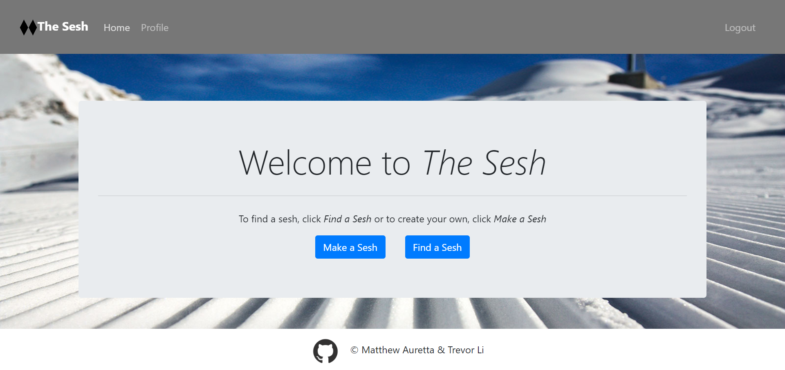

# The Sesh

The Sesh is an application that allows users to create a profile, post when and where they would like to ski or snowboard, and search for others' post as well as comment on them.

[Live Demo](https://still-basin-27239.herokuapp.com/)

## Built With

* [ReactJS](https://reactjs.org/) - Web Framework
* [MongoDB](https://www.mongodb.com/) - Database
* [Mongoose](https://mongoosejs.com/) - Database Object Modeling
* [Node.js](https://nodejs.org/en/) - Server Enviornment
* [Express.js](https://expressjs.com/) - Server Framework
* [Axios](https://www.npmjs.com/package/axios) - XML HTTP Requests Helper
* [bcrypt](https://www.npmjs.com/package/bcrypt) - User Authentication Helper
* [Bootstrap](https://getbootstrap.com/) - Styling Library
* [Sass](https://sass-lang.com/) - CSS Extension Language

## Authors
* **Matt Auretta** - [MattAuretta](https://github.com/MattAuretta)
* **Trevor Li** - [yiqi0110](https://github.com/yiqi0110)

## Screenshot

